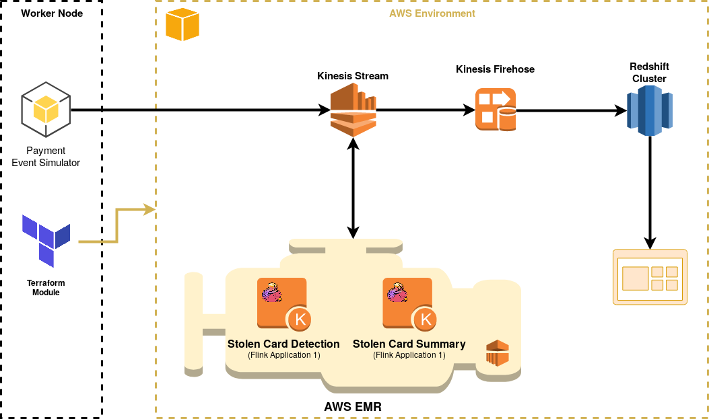

# Payments Data Assignment

## Requirements

The primary purpose of this task is to notify the risk team of any payment transactions linked to stolen cards. Such notification allows the team to act in a timely manner before the funds are actually used.

### Pre-requisites

- Generate a list of valid test card numbers and mark 10% of such cards as stolen 

- Setup a single node Redshift cluster

- Setup a kinesis stream used to receive the simulated events identified by a type field for e.g.:

	- PAYMENT_EVENT – Used to label each and every payment transaction type (irrespective from whether it is linked to a stolen card or not)

	- PAYMENT_ALERT – Used to label a payment transaction linked to a stolen card

	- PAYMENT_ALERT_SUMMARY – Used to label an event that includes a summarized view of all the payments linked to a stolen card, during the last 60 minutes

- Setup a single firehose stream to receive all incoming events into a staging table

	- In a real world scenario you will have multiple firehose streams, but to keep the AWS costs down, for the scope of this task, its ok to have a single firehose stream staging all events in one single table including the following fields:

		- event_date_origin (timestamp) – In event driven architectures, a very crucial aspect is when an event was created, not when an event was received. So the receiving end should determine whether, in the current context, the event is still valid or not. So in the case of this task, the payment events simulator will be the service setting this field.

		- event_dw_regdate (timestamp) – It is also very important to store the time that an event was written in our datawarehouse, this would allow us to monitor and analyse and event latency issues.

		- event_json_data (text) – This will be a generic field containing json data, and it will contain different fields according to the event type as specified above.

### Core modules to be developed

- Payment events simulator:

	- Read all card data from the a text file

	- Indefinitely generates payments events linked to randomly selected card from the previous list

	- Publishes each and every event to a Kinesis stream

- Flink Event Application 1 (Payments Linked to Stolen Cards):

	- Runs very 5 seconds evaluating events during the previous 5 seconds

	- Consumes events from the kinesis stream

	- Identify payments linked with stolen cards

	- Immediately push such events to Kinesis using event type [PAYMENT_ALERT_SUMMARY]

- Flink Event Application 2 (Payments Linked to Stolen Cards Summary):

	- Runs very 10 seconds evaluating events during the previous 60 minutes

	- Consumes events from the kinesis stream

	- Identify payments linked with stolen cards

	- Immediately push such events to Kinesis using event type [PAYMENT_ALERT]

